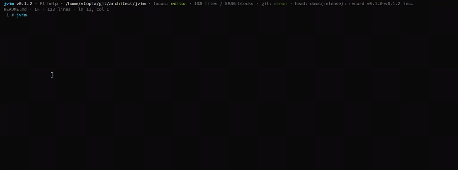

# jvim

> AI-native TUI markdown workspace — vim-like ergonomics, Notepad-friendly defaults.

[](https://www.npmjs.com/package/jvim)
[](./LICENSE)
[](https://github.com/jhl-labs/jvim-public/issues)
[](https://github.com/jhl-labs/jvim-public/releases)

`jvim` is a terminal-native markdown editor with a modern workspace model:
full-text + semantic search, wikilinks, tag browser, git integration, and an
AI overlay. It is designed to feel like Notepad out of the box while giving
keyboard users the power of vim.

> **Source:** the `jvim` source code is **not public**. This repository hosts
> issues, releases, documentation, and public-facing assets. Distribution is
> via precompiled, obfuscated binaries on **npm** and **GitHub Releases**.

## Demo



👉 원본 영상(음성·고화질): [jvim_demo.mp4](./jvim_demo.mp4)
## Install

### npm (recommended)

```bash
npm install -g jvim
jvim --version
```

npm resolves the correct precompiled binary for your platform automatically
via `optionalDependencies` gated on `os`/`cpu`. Supported today:
**linux-x64**, **linux-arm64**.

### GitHub Releases (standalone binary)

Download the tarball matching your platform from the
[Releases page](https://github.com/jhl-labs/jvim-public/releases),
verify the checksum, and place the binary on your `PATH`:

```bash
tar -xzf jvim-<version>-linux-x64.tar.gz
sha256sum -c jvim-<version>-linux-x64.tar.gz.sha256
sudo mv jvim /usr/local/bin/
jvim --version
```

## Quick start

```bash
# Open a file
jvim notes.md

# Open a workspace folder
cd my-vault && jvim

# Show the in-app keymap
# press F1 inside jvim
```

## Features

- **Markdown-first editor** — live styling for headings, emphasis, lists,
  code fences, tables, inline `[text](url)` links, and horizontal rules.
- **Notepad-style shortcuts** — Ctrl+C/X/V/A/Z/Y/S/O/N and Shift+Arrow
  selection work exactly where your muscle memory expects.
- **Vim-friendly tree** — j/k/g/G navigation, n/r/d file operations,
  type-to-filter search in the file tree.
- **Wikilinks and backlinks** — `[[file]]` autocomplete, outbound overlay,
  backlink graph.
- **Tag browser** — `#tag` autocomplete and a dedicated tag browser (F7).
- **Full-text + semantic search** — SQLite FTS5 plus optional vector
  embeddings. Case-sensitive toggle, vault-wide search.
- **AI overlay** — inline completion, edit modes, quick prompts (Ctrl+/ or F6).
- **Git-aware** — commit log viewer, in-editor diff display, vault-aware
  indexing that survives `git checkout`.
- **Single-binary distribution** — one file per platform, no Node runtime,
  no `node_modules`.

Full keymap in [`docs/keymap.md`](./docs/keymap.md) or press **F1** in-app.

## Support & community

| Need | Channel |
|---|---|
| Report a bug | [New issue → Bug report](https://github.com/jhl-labs/jvim-public/issues/new?template=bug_report.yml) |
| Request a feature | [New issue → Feature request](https://github.com/jhl-labs/jvim-public/issues/new?template=feature_request.yml) |
| Ask a question | [New issue → Question](https://github.com/jhl-labs/jvim-public/issues/new?template=question.yml) |
| Report a security vulnerability | See [`SECURITY.md`](./SECURITY.md) |

## Release assets

Every release attaches, alongside the binaries:

- **Binaries** — `jvim-<version>-linux-{x64,arm64}.tar.gz` + matching `.sha256`
- **Test report** — `test-report.html`
- **Coverage report** — `coverage-lcov.info`
- **SBOM** — `sbom.json` (CycloneDX)
- **Security scan** — `trivy-scan.json`, `osv-scan.json`

See [`docs/reports/README.md`](./docs/reports/README.md) for how to read them.

## Project status

**Pre-1.0.** Interfaces may change between minor versions. Production use is
welcome but expect occasional churn; see [`CHANGELOG.md`](./CHANGELOG.md) for
release notes.

## License

`jvim` is distributed under the **jvim Software License** — a custom
proprietary-with-free-binary-use license, modeled after the licensing
approach used by products like Anthropic's Claude Code.

**In plain language:**

- ✅ **Binary use is free.** You can install, run, and redistribute the
  unmodified compiled Binaries — personally or commercially, on any number
  of devices, as part of any product or service, without royalty.
- ❌ **Source code is proprietary.** You do **not** receive any license to
  the `jvim` source code by using the Binaries. The source is not open.
- ❌ **No reverse engineering.** Decompilation, de-obfuscation, and any
  attempt to derive the source or internal design from the Binaries are
  prohibited (except where local law guarantees that right).
- ❌ **No unauthorized use if you accidentally obtain the source.** If you
  ever come into possession of `jvim` source code, build artifacts, or
  internal documentation by any means — a leak, a misconfigured repository,
  a security research finding, a compelled disclosure, an audit, or
  anything else — you may **not** use, copy, study, or redistribute it
  without **prior written permission** from JHL Labs. Please notify
  `bkperio@gmail.com` and destroy copies on request.
- ❌ **No use as ML training data.** You may not use the Binaries or any
  derived artifact as input to any machine-learning model or dataset.

Source-code licensing, partnerships, and other commercial arrangements are
negotiable — contact **bkperio@gmail.com**.

Full terms: see [`LICENSE`](./LICENSE) and [`NOTICE`](./NOTICE). Third-party
dependency licenses covering code bundled inside the Binaries ship as
`third-party-notices.txt` with every release.
