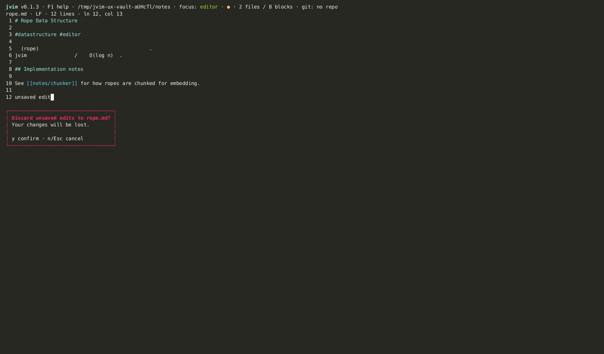

import AsciinemaPlayer from '../../../../components/AsciinemaPlayer.astro';
import KeymapTable from '../../../../components/KeymapTable.astro';

Every file you open in jvim becomes a **buffer** — an in-memory copy of the file's content. You can have many buffers open at once. When two or more are open, jvim shows a tab bar at the top of the editor area so you can see all open files and cycle between them without using the file tree.

<AsciinemaPlayer slug="buffers-tabs" title="Buffers and tabs: cycle, close, dirty marker" />

## Opening Multiple Buffers

Open additional files by pressing `Ctrl+O` (file palette) or by pressing `Enter` on a file in the file tree. Each opened file appears as a new tab. The tab bar becomes visible as soon as there are two or more open buffers.

<KeymapTable rows={[
  { keys: 'Ctrl+O', action: 'Open file palette', notes: 'Fuzzy-search the vault and open a file into a new buffer' },
  { keys: 'Ctrl+N', action: 'New buffer', notes: 'Create an empty unnamed buffer' },
]} />

## Cycling Between Buffers

Cycle through open buffers with keyboard shortcuts. The tab bar highlights the currently active buffer.

<KeymapTable rows={[
  { keys: 'Ctrl+PgDn', action: 'Next buffer', notes: 'Switch to the next tab to the right' },
  { keys: 'Ctrl+PgUp', action: 'Previous buffer', notes: 'Switch to the previous tab to the left' },
]} />

Some terminals capture `Ctrl+PgUp` / `Ctrl+PgDn` for their own tab switching before passing the keys to the application. If the shortcuts do not respond, move focus to the file tree first (press `Ctrl+E`), then use `Ctrl+Shift+→` / `Ctrl+Shift+←` to cycle buffers instead.

## Closing Buffers

Close the active buffer with `Ctrl+W`. If the buffer has unsaved changes (marked with `●`), jvim shows a confirmation prompt before closing.

<KeymapTable rows={[
  { keys: 'Ctrl+W', action: 'Close current buffer', notes: 'Prompts for confirmation if the buffer has unsaved changes' },
  { keys: 'Ctrl+S', action: 'Save buffer', notes: 'Save before closing to avoid the confirmation prompt' },
]} />

If you close the last open buffer, jvim returns to an empty editor state. The application stays open — you can open a new file or create a new buffer immediately.

## Dirty Marker

Each tab in the tab bar shows the file's basename. When the buffer has unsaved changes, a `●` (filled circle) appears alongside the filename. The dot disappears as soon as you save with `Ctrl+S`.

This marker is per-buffer — you can have some tabs clean and others dirty simultaneously. The `●` also appears in the main status bar for the currently active buffer.

## Related

- [Editor Basics](/jvim-public/en/usage/editor-basics/)
- [Navigation](/jvim-public/en/usage/navigation/)
- [Keymap — full reference](/jvim-public/en/keymap/full/)
