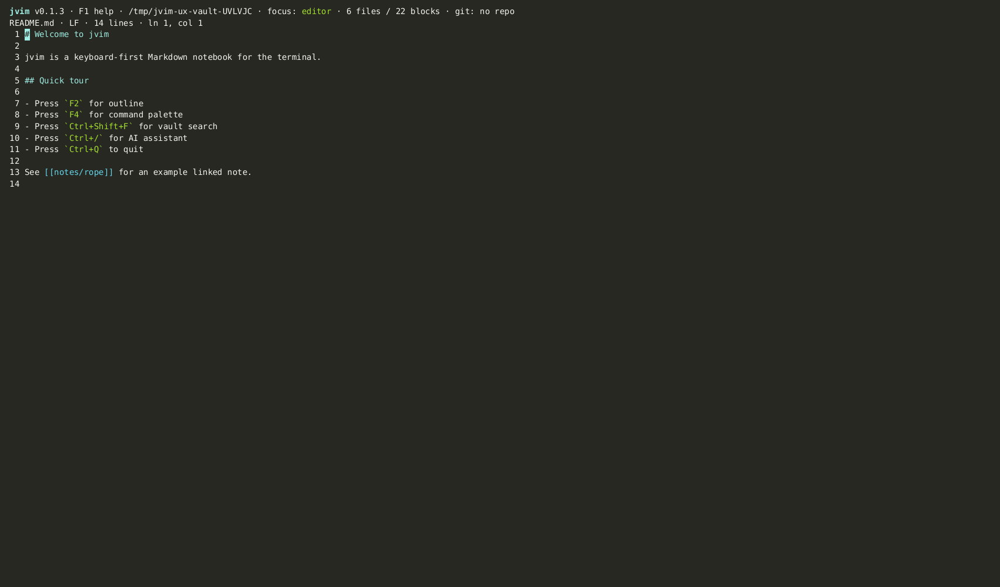

import AsciinemaPlayer from '../../../../components/AsciinemaPlayer.astro';
import KeymapTable from '../../../../components/KeymapTable.astro';

jvim launches directly into an editable buffer — no mode switching, no setup. This page covers the fundamentals: opening files and vaults, reading the status bar, saving, and undo/redo.

<AsciinemaPlayer slug="editor-basics" title="Editor basics: open, edit, save" />

## Opening Files and Vaults

Pass a single file or a directory to `jvim` from the terminal. Both work:

```
jvim notes.md          # open one file
jvim ./my-vault/       # open a vault (file tree on the left)
```

If the path does not exist, jvim creates an empty buffer — the same semantics as `vi` or Notepad. The file is only written to disk when you explicitly save.



<KeymapTable rows={[
  { keys: 'Ctrl+S', action: 'Save', notes: 'Atomic write + fsync — prevents partial writes on crash' },
  { keys: 'Ctrl+Shift+S', action: 'Save as', notes: 'Write to a new path; current buffer follows the new file' },
]} />

## Status Bar Indicators

The top status bar updates in real time as you edit. The key markers:

- **`●`** — the buffer has unsaved changes.
- **EOL** — the current line-ending style (`LF`, `CRLF`).
- **Save state** — shows `Saved` momentarily after a successful write.
- **Git diff summary** — insertions/deletions relative to the last commit, updated on each save.

Until you save, only the in-memory buffer is modified. The `●` dot disappears as soon as `Ctrl+S` completes.

## Undo, Redo, and Select All

jvim keeps a full undo history for the session. There is no undo limit during a single editing session.

<KeymapTable rows={[
  { keys: 'Ctrl+Z', action: 'Undo', notes: 'Step back one edit' },
  { keys: 'Ctrl+Y', action: 'Redo', notes: 'Re-apply an undone edit' },
  { keys: 'Ctrl+A', action: 'Select all', notes: 'Select the entire buffer contents' },
]} />

## EOF Padding

Empty lines at the bottom of the viewport are padded with vim-style `~` markers. These are visual only — they do not appear in the file. The padding makes the viewport boundary obvious so you always know where the document ends.

## Related

- [File Tree](/jvim-public/en/usage/file-tree/)
- [Find & Replace](/jvim-public/en/usage/find-replace/)
- [Keymap — essentials](/jvim-public/en/keymap/essentials/)
