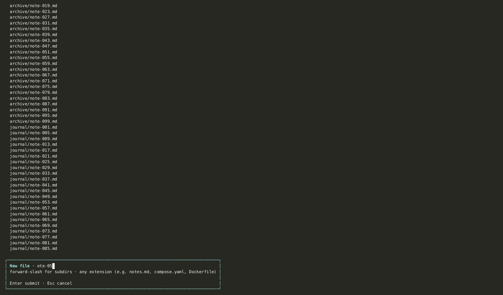

import AsciinemaPlayer from '../../../../components/AsciinemaPlayer.astro';
import KeymapTable from '../../../../components/KeymapTable.astro';

The file tree sits on the left side of the jvim layout when you open a vault directory. It uses vim-style movement keys and supports instant type-to-filter so you can locate files without leaving the keyboard.

<AsciinemaPlayer slug="file-tree" title="File tree: filter, open, create, rename" />

## Focusing the Tree

The tree and the editor share the same window. Toggle focus between them at any time:

<KeymapTable rows={[
  { keys: 'Ctrl+E', action: 'Focus file tree', notes: 'Switch focus from editor to tree' },
  { keys: 'Tab', action: 'Focus file tree', notes: 'Same as Ctrl+E' },
  { keys: 'q', action: 'Back to editor', notes: 'Return focus to the editor pane' },
]} />

## Navigating the Tree

Once the tree has focus, use standard vim movement keys to move through entries:

<KeymapTable rows={[
  { keys: 'j / k', action: 'Move down / up', notes: 'One entry at a time' },
  { keys: 'g', action: 'Jump to top', notes: 'First entry in the tree' },
  { keys: 'G', action: 'Jump to bottom', notes: 'Last entry in the tree' },
  { keys: 'Enter', action: 'Open file', notes: 'Opens the selected file in the editor' },
]} />

## Real-Time Type-to-Filter

With tree focus active, start typing any sequence of characters. The tree filters instantly — only entries whose names contain the typed string remain visible.

There is no separate search box to open. The filter activates as soon as a printable character is typed. Press `Backspace` to narrow or broaden the filter, or `Esc` to clear it and show all entries again.

## Creating, Renaming, and Deleting Files

All file management operations are available directly inside the tree. A confirmation dialog appears before any destructive action.

<KeymapTable rows={[
  { keys: 'n', action: 'New file', notes: 'Prompts for a filename; creates the file in the current directory' },
  { keys: 'r', action: 'Rename', notes: 'Rename the currently selected entry' },
  { keys: 'd', action: 'Delete', notes: 'Delete with a confirmation dialog — cannot be undone' },
]} />

## EOF Padding in Sparse Vaults

Empty or lightly-populated vaults show `~` padding below the last tree entry, consistent with the editor viewport. The markers are visual only.

## Related

- [Editor Basics](/jvim-public/en/usage/editor-basics/)
- [Navigation](/jvim-public/en/usage/navigation/)
- [Keymap — essentials](/jvim-public/en/keymap/essentials/)
