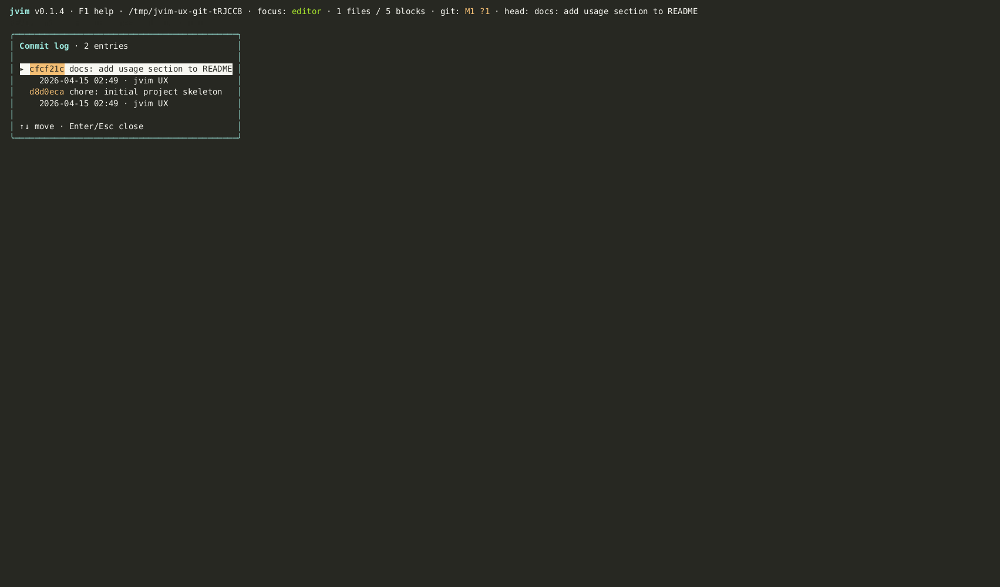

import AsciinemaPlayer from '../../../../components/AsciinemaPlayer.astro';
import KeymapTable from '../../../../components/KeymapTable.astro';

jvim treats a vault directory as a git repository. The status bar shows live diff counts for the current file, a dedicated panel lists per-file hunks, and the command palette exposes commit, push, pull, and fetch without leaving the editor. Under the hood jvim uses the system `git` binary — your existing credential helper, SSH agent, and GPG signing config all apply automatically.

<AsciinemaPlayer slug="git" title="Git: diff panel, commit, push, pull" />

## Live Diff in the Status Bar

While editing, the status bar header shows a live `+N / −M` count of added and removed lines relative to the last commit. The count updates each time you save. A zero count means the file is clean.

This indicator gives you a constant read on how far the working tree has drifted from HEAD without opening any overlay.

## Commit Log Overlay

`Ctrl+L` opens the commit log overlay — a list of recent commits with author, short SHA, and commit message. Use it to review history or verify that a recent commit landed.

<KeymapTable rows={[
  { keys: 'Ctrl+L', action: 'Open commit log', notes: 'Shows recent commits: author, SHA, message' },
  { keys: '↑ / ↓', action: 'Navigate entries', notes: 'Browse the commit list' },
  { keys: 'Esc', action: 'Close overlay', notes: 'Return to the editor' },
]} />

## Git Panel

`F5` opens the Git panel for the current repository. From there you can inspect current-file hunks and run common git actions.

<KeymapTable rows={[
  { keys: 'F5', action: 'Open Git panel', notes: 'Shows current-file git status and panel actions' },
  { keys: 'd', action: 'Open current-file diff', notes: 'Shows diff hunks for the active file' },
  { keys: 'c', action: 'Commit current file', notes: 'Prompts for a message and stages the active file' },
  { keys: 'p / P / f', action: 'Push / pull / fetch', notes: 'Runs the corresponding system git command' },
]} />

## Current-File Diff Hunk Panel

The diff hunk panel shows uncommitted changes in the current file broken into individual hunks — the same view you'd get from `git diff HEAD <file>`, rendered inline.

<KeymapTable rows={[
  { keys: 'Ctrl+P / F4', action: 'Open command palette', notes: 'Type "diff" to open the current-file diff panel' },
]} />

Each hunk shows the old and new lines side by side. Navigate hunks with arrow keys. The panel is read-only — changes are made in the editor buffer as normal and saved with `Ctrl+S`.

## Commit, Push, Pull, Fetch

Git operations are available through the Git panel (`F5`) and selected command-palette actions (`F4` or `Ctrl+P`). Type the operation name to filter:

- **commit** — opens the Git panel; use `c` there to commit the current file.
- **push** — pushes the current branch to its upstream remote.
- **pull** — fetches and fast-forwards (`--ff-only`). If the local branch has diverged, the pull is refused rather than creating a merge commit. Rebase or reset manually before retrying.
- **fetch** — fetches from the remote without merging.

<KeymapTable rows={[
  { keys: 'F5', action: 'Open Git panel', notes: 'Diff and current-file commit actions' },
  { keys: 'F4 / Ctrl+P', action: 'Open command palette', notes: 'Type git action names to find available operations' },
]} />

Progress and errors appear as toast notifications in the status bar. A push that requires authentication will prompt via the system credential helper or SSH agent — jvim does not manage credentials itself.

## System Git Under the Hood

jvim shells out to the `git` binary found on your `PATH`. This means:

- Your `~/.gitconfig` (user name, email, signing key) is respected.
- SSH agent forwarding works without any extra configuration in jvim.
- GPG or SSH commit signing follows your existing git config.
- `.gitignore` files are honored for all git operations.

If `git` is not on your `PATH`, git integration is silently disabled and the diff indicator is not shown.

## Re-indexing After Checkout

The vault search database and link metadata are vault-aware and survive `git checkout` without corruption. If you switch branches and the vault contents change significantly, trigger a manual re-index:

<KeymapTable rows={[
  { keys: 'Ctrl+R', action: 'Re-index vault', notes: 'Rebuilds the full-text search database and link metadata' },
]} />

## Related

- [Editor Basics](/jvim-public/en/usage/editor-basics/)
- [Keymap — full reference](/jvim-public/en/keymap/full/)
