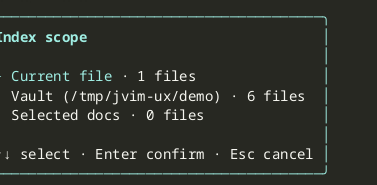

import AsciinemaPlayer from '../../../../components/AsciinemaPlayer.astro';
import KeymapTable from '../../../../components/KeymapTable.astro';

jvim's Tier 2 semantic index generates vector embeddings with `sqlite-vec` and stores them locally alongside your vault. Unlike full-text search, the semantic index lets the AI Ask mode find conceptually related notes even when they share no keywords. You choose exactly which files to index — jvim never silently embeds your entire vault.

<AsciinemaPlayer slug="semantic-index" title="Semantic Index: scope picker and embedding build" />

## Opening the Scope Picker

Press `Shift+F5` to open the scope selection dialog. The dialog presents three options and waits for your choice before doing any work.

<KeymapTable rows={[
  { keys: 'Shift+F5', action: 'Open semantic scope picker', notes: 'No embeddings are built until you confirm a scope' },
  { keys: 'Esc', action: 'Cancel', notes: 'Closes the dialog without modifying the index' },
]} />

## Scope Options

| Scope | What gets indexed |
|---|---|
| **Current document** | Only the file that is open in the editor. Fast; useful for a quick AI-assisted review of a single note. |
| **Vault** | Every file in the vault. The most complete index; prompts a confirmation dialog before starting because it may take time on large vaults. |
| **Favorites + current** | Files you have marked as favorites with `F11`, plus the document currently open. A focused middle ground that keeps the index small while covering your most important notes. |

After choosing a scope, jvim builds (or incrementally updates) the embedding index in the background. A progress indicator appears in the status bar while the build is running.

## Large-Scope Confirmation

When you select **Vault** and the vault contains many files, jvim shows a confirmation dialog that estimates the number of files to be embedded. This gives you a chance to review the scope and the expected processing time before committing. Press `Enter` to proceed or `Esc` to cancel.

<KeymapTable rows={[
  { keys: 'Enter', action: 'Confirm and start embedding', notes: 'Dismisses the confirmation dialog and begins the build' },
  { keys: 'Esc', action: 'Cancel the confirmation', notes: 'Returns to the scope picker; no files are embedded' },
]} />

## Marking Favorites

The **Favorites + current** scope is only useful once you have tagged some files as favorites. Press `F11` while a file is open to toggle its favorite status. Favorited files appear with a star marker in the file tree and are included in the "Favorites + current" index build.

<KeymapTable rows={[
  { keys: 'F11', action: 'Toggle favorite', notes: 'Star marker in file tree; included in Favorites + current scope' },
]} />

## AI Ask Mode and RAG

Once the index is built, the AI Ask mode (`Ctrl+K` overlay) uses it as the retrieval source. When you ask a question, jvim embeds your query and fetches the most semantically relevant chunks from the index to include as context. The quality of the RAG context depends directly on the scope you chose: a broader, up-to-date index produces more relevant results.

Re-run `Shift+F5` whenever you add notes you want available in the AI context.

## Related

- [AI Overlay](/jvim-public/en/usage/ai-overlay/)
- [Vault Search](/jvim-public/en/usage/vault-search/)
- [Keymap — full reference](/jvim-public/en/keymap/full/)
