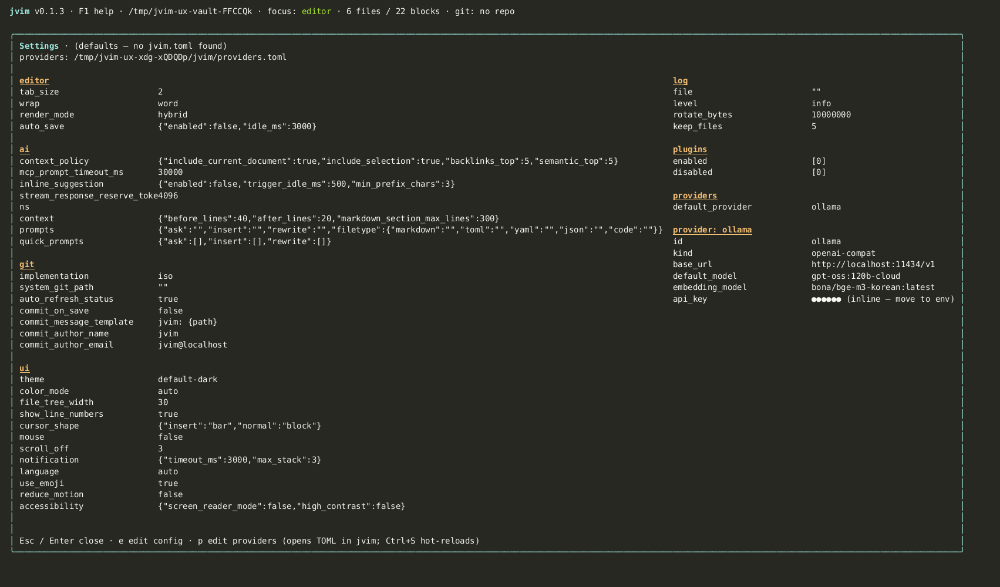
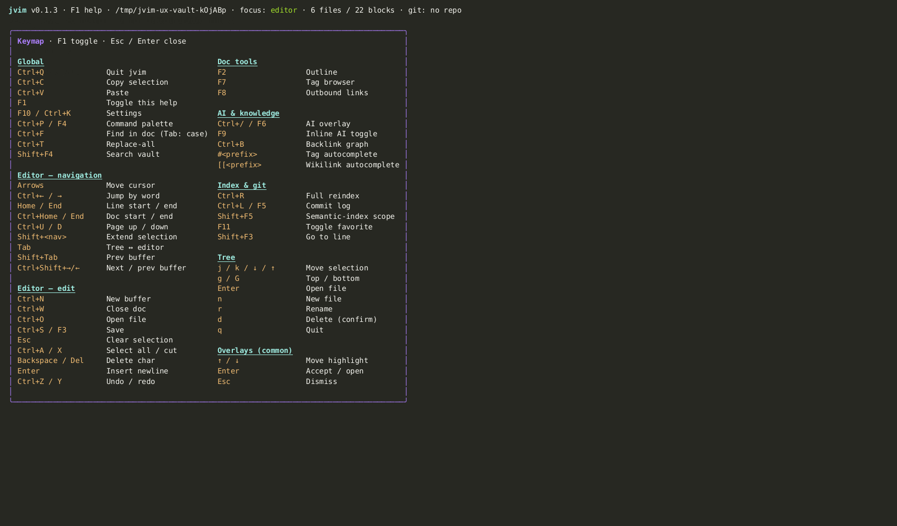

import AsciinemaPlayer from '../../../../components/AsciinemaPlayer.astro';
import KeymapTable from '../../../../components/KeymapTable.astro';

jvim stores all configuration in a single `config.toml` file. You can edit it directly or use the built-in settings overlay (`F10`), which opens the file inside jvim with syntax validation. Changes take effect immediately on save — no restart required.

<AsciinemaPlayer slug="settings" title="Settings: overlay, config.toml, F1 help" />

## Settings Overlay

Press `F10` (or `Ctrl+K`) to open the settings overlay. This is a full-text editor for `config.toml` with the same keybindings as the main editor. Save with `Ctrl+S` to apply.



<KeymapTable rows={[
  { keys: 'F10 / Ctrl+K', action: 'Open settings overlay', notes: 'Opens config.toml in an editable overlay' },
  { keys: 'Ctrl+S', action: 'Save and apply', notes: 'Writes config.toml and applies changes without restart' },
  { keys: 'Esc', action: 'Close without saving', notes: 'Discard edits and return to the editor' },
]} />

If the TOML contains a syntax error when you save, jvim shows an error toast and keeps the previous valid configuration active. Your edited (invalid) text remains in the overlay so you can fix it.

## Config File Location

The configuration file lives at:

```
~/.config/jvim/config.toml
```

You can also edit this file with any text editor outside of jvim. Changes made externally are picked up the next time jvim starts.

## Key Configuration Sections

### Editor

```toml
[editor]
tab_size = 2
line_numbers = true
scroll_off = 5
```

### AI Providers

```toml
[ai]
provider = "openai"          # openai | anthropic | ollama | custom
model = "gpt-4o"
inline_model = "gpt-4o-mini" # optional: separate model for ghost-text
```

See [AI Overlay](/jvim-public/en/usage/ai-overlay/) for the full provider setup guide.

### Updates

```toml
[updates]
check_on_start = true    # set to false to disable npm update checks
```

## F1 Help Overlay

`F1` opens a searchable keymap reference inside jvim. It lists every available shortcut grouped by category. Type to filter — the list narrows in real time.



<KeymapTable rows={[
  { keys: 'F1', action: 'Open keymap help overlay', notes: 'Searchable shortcut reference, always available' },
  { keys: 'Type to filter', action: 'Narrow the list', notes: 'Shows only matching shortcuts as you type' },
  { keys: 'Esc', action: 'Close help', notes: 'Return to the editor' },
]} />

The help overlay is a quick in-app reference — for the full annotated keymap, see [Keymap — full reference](/jvim-public/en/keymap/full/).

## First-Run Setup Wizard

When jvim launches for the first time and finds no `config.toml`, it runs a TUI setup wizard. The wizard asks for:

- Your preferred AI provider and API key (optional — skip to use jvim without AI features)
- Editor preferences (tab size, line numbers)

The wizard writes the resulting `config.toml` and exits. You can re-run or adjust any setting later via `F10`.

## Settings Reload Without Restart

All settings changes made through the `F10` overlay take effect immediately when you save. There is no need to quit and relaunch jvim. The only exception is changes to the AI provider base URL, which require a restart to reconnect the HTTP client.

## Related

- [AI Overlay](/jvim-public/en/usage/ai-overlay/)
- [Keymap — full reference](/jvim-public/en/keymap/full/)
