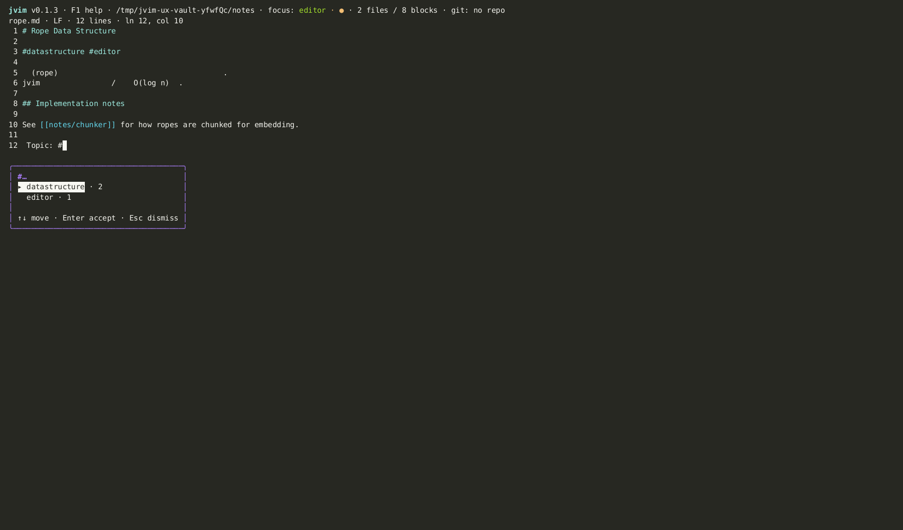

import AsciinemaPlayer from '../../../../components/AsciinemaPlayer.astro';
import KeymapTable from '../../../../components/KeymapTable.astro';

jvim treats inline tags as searchable note metadata. When you type `#` in the editor, a completion popup can suggest tags already found in the open folder. The `F7` tag browser lists tags with counts and can hand a selected tag off to vault search.

<AsciinemaPlayer slug="tags" title="Tags: autocomplete and tag browser" />

## Tag Autocomplete

Type `#` anywhere in the editor body and jvim opens a real-time completion popup listing vault-wide tags that match the characters you have typed so far. The list updates on every keystroke. Select an entry and press `Enter` to insert the complete tag into the document; `Esc` dismisses the popup without inserting anything.

<KeymapTable rows={[
  { keys: '#', action: 'Trigger tag autocomplete', notes: 'Opens the completion popup as you type the tag name' },
  { keys: '↑ / ↓', action: 'Navigate suggestions', notes: 'Moves the selection through the tag list' },
  { keys: 'Enter', action: 'Insert selected tag', notes: 'Completes the tag and returns focus to the editor' },
  { keys: 'Esc', action: 'Dismiss popup', notes: 'Closes without inserting; cursor stays at the # position' },
]} />

## Tag Browser

Press `F7` to open the tag browser overlay. The browser shows every tag in the vault together with:

- **Frequency** — how many files carry that tag.
- **Representative file** — one matching file path to help identify where the tag appears.

Type any characters to filter the list by prefix. When you find the tag you want, press `Enter` to hand off to vault search with a `tag:<name>` query pre-filled.

<KeymapTable rows={[
  { keys: 'F7', action: 'Open tag browser', notes: 'Vault-wide tag list with frequency counts and a representative file' },
  { keys: '↑ / ↓', action: 'Navigate tags', notes: 'Moves through the filtered tag list' },
  { keys: 'Enter', action: 'Search files with this tag', notes: 'Hands off to vault search with tag:<name> pre-filled' },
  { keys: 'Esc', action: 'Close tag browser', notes: 'Returns focus to the editor' },
]} />

## Prefix Filtering

Inside the tag browser, start typing to narrow the list to tags that begin with those characters. The filter is case-insensitive and updates in real time. Clear the filter with `Backspace` to return to the full tag list.

## Related

- [Wikilinks](/jvim-public/en/usage/wikilinks/)
- [Vault Search](/jvim-public/en/usage/vault-search/)
- [Keymap — full reference](/jvim-public/en/keymap/full/)
