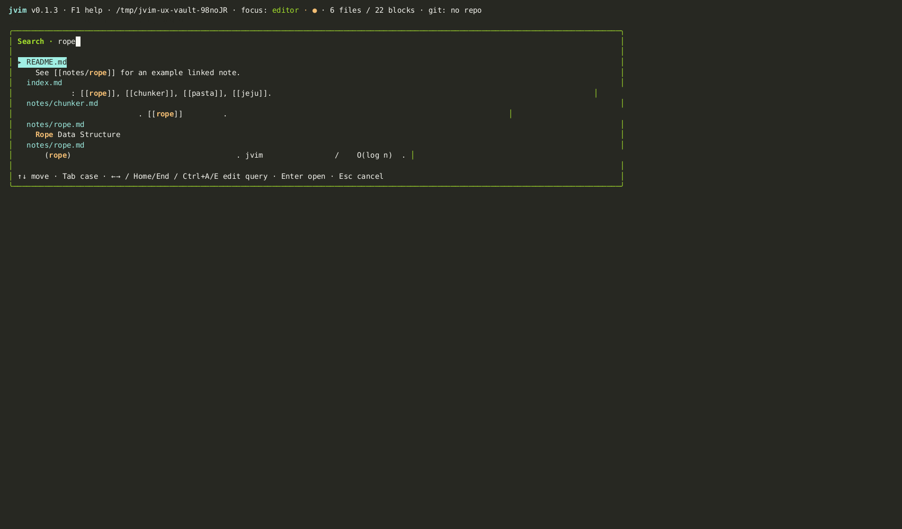

import AsciinemaPlayer from '../../../../components/AsciinemaPlayer.astro';
import KeymapTable from '../../../../components/KeymapTable.astro';

jvim indexes every file in your vault with SQLite FTS5, giving you sub-second full-text search regardless of vault size. The search overlay supports plain queries as well as `#tag` and `[[wikilink]]` tokens so you can think in Obsidian-style notation and get matching results immediately.

<AsciinemaPlayer slug="vault-search" title="Vault Search: full-text search, tag queries, case toggle" />

## Opening the Search Overlay

Press `Shift+F4` to open the vault search overlay from anywhere in jvim. Start typing and results appear in real time. Each result row shows the filename and a preview of the matching line so you can identify the right file at a glance.

<KeymapTable rows={[
  { keys: 'Shift+F4', action: 'Open vault search overlay', notes: 'Searches titles, body text, and tags across all files' },
  { keys: 'Enter', action: 'Open selected file', notes: 'Jumps to the file; cursor placed at the matched line' },
  { keys: 'Esc', action: 'Close overlay', notes: 'Returns focus to the editor without navigating' },
]} />

## Special Query Tokens

The search input understands two extra token types in addition to plain words:

- **`#tag`** — matches files that contain the specified tag. For example, type `#travel` to find every file tagged with `#travel`.
- **`[[wikilink]]`** — matches files that contain a wikilink referencing the given title. For example, `[[chunker]]` finds files that link to `chunker`.

You can combine these with regular keywords in a single query: `#project meeting notes` finds files tagged `#project` whose body also contains the words "meeting" and "notes".

## Case Sensitivity Toggle

By default the search is case-insensitive. Press `Tab` inside the overlay to toggle case sensitivity. An `Aa` badge appears next to the search input when case-sensitive mode is active; press `Tab` again to return to case-insensitive mode.

<KeymapTable rows={[
  { keys: 'Tab', action: 'Toggle case sensitivity', notes: 'Aa badge is shown when case-sensitive mode is on' },
]} />

## Navigating Results

<KeymapTable rows={[
  { keys: '↑ / ↓', action: 'Move through results', notes: 'Each row shows filename and the matched line preview' },
  { keys: 'Enter', action: 'Open the highlighted file', notes: 'Cursor is placed at the line containing the match' },
]} />

## Semantic Search

Vault search uses keyword full-text matching (FTS5). For vector-based semantic search — "files about similar concepts" — see the [Semantic Index](/jvim-public/en/usage/semantic-index/) page, which describes the separate Tier 2 embedding index and its `Shift+F5` scope selector.

## Related

- [Semantic Index](/jvim-public/en/usage/semantic-index/)
- [Tags](/jvim-public/en/usage/tags/)
- [Navigation](/jvim-public/en/usage/navigation/)
- [Keymap — full reference](/jvim-public/en/keymap/full/)
