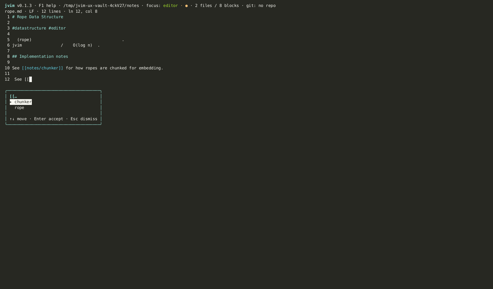
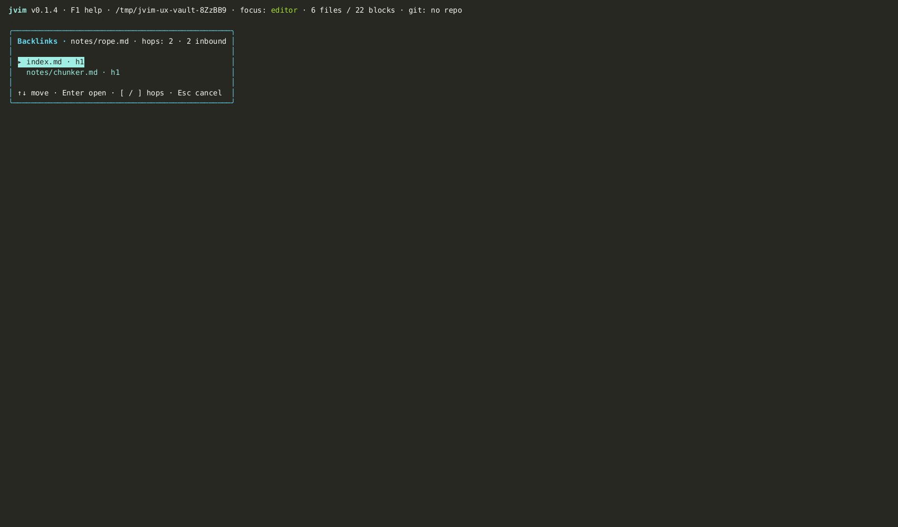

import AsciinemaPlayer from '../../../../components/AsciinemaPlayer.astro';
import KeymapTable from '../../../../components/KeymapTable.astro';

jvim supports Obsidian-compatible `[[wikilink]]` syntax for connecting notes within your vault. Type `[[` anywhere in the editor to start a vault-wide fuzzy search, follow links with a keypress, and see every note that references the current file via the backlink graph.

<AsciinemaPlayer slug="wikilinks" title="Wikilinks: autocomplete, outbound, backlink graph" />

## Wikilink Autocomplete

Type `[[` in the editor and jvim opens an inline autocomplete overlay with every file in the vault. Fuzzy matching applies — you don't need to type the exact filename.

<KeymapTable rows={[
  { keys: '[[', action: 'Open wikilink autocomplete', notes: 'Triggers vault-wide file search inline' },
  { keys: '↑ / ↓', action: 'Select candidate', notes: 'Navigate the completion list' },
  { keys: 'Tab / Enter', action: 'Insert link', notes: 'Completes the wikilink and closes the overlay' },
  { keys: 'Esc', action: 'Dismiss', notes: 'Cancel without inserting' },
]} />

The inserted link uses the bare filename without extension, matching Obsidian's canonical wikilink format: `[[my-note]]`. If the target file does not exist yet, the link is still valid — jvim will create the file when you navigate to it.

## Outbound Links Panel

`F8` opens the outbound links panel for the current document — every `[[wikilink]]` this file references, listed in one overlay. Use it to review where the current note connects before navigating away.

<KeymapTable rows={[
  { keys: 'F8', action: 'Open outbound links panel', notes: 'Shows all wikilinks in the current document' },
  { keys: '↑ / ↓', action: 'Select link', notes: 'Move through the outbound link list' },
  { keys: 'Enter', action: 'Open target file', notes: 'Opens the linked note in the editor' },
  { keys: 'Esc', action: 'Close panel', notes: 'Return to the editor' },
]} />

## Backlink Graph

`Ctrl+B` opens the backlink graph — every note in the vault that references the current file with `[[wikilink]]`. This is the reverse of the outbound panel: instead of where this note goes, it shows who links here.

<KeymapTable rows={[
  { keys: 'Ctrl+B', action: 'Open backlink graph', notes: 'Shows all notes that link to the current file' },
  { keys: '↑ / ↓', action: 'Select backlink', notes: 'Move through the list of referencing notes' },
  { keys: '[ / ]', action: 'Hop to neighbor', notes: 'Navigate to an adjacent note while keeping the path highlighted' },
  { keys: 'Enter', action: 'Open selected note', notes: 'Opens the backlink source in the editor' },
  { keys: 'Esc', action: 'Close graph', notes: 'Return to the editor' },
]} />

## Wikilinks vs. Markdown Links

jvim supports both `[[wikilink]]` and standard Markdown `[text](path.md)` syntax. The key differences:

| | Wikilink `[[...]]` | Markdown link `` |
|---|---|---|
| Autocomplete | Yes — triggers on `[[` | No |
| Backlink tracking | Yes — indexed by jvim | No |
| Portability | Obsidian / jvim | All Markdown renderers |
| External URLs | Not suitable | `[text](https://...)` |

Use wikilinks for vault-internal connections where you want autocomplete and backlink tracking. Use standard Markdown links for external URLs or when portability to non-Obsidian tools matters.

## Related

- [Tags](/jvim-public/en/usage/tags/)
- [Vault Search](/jvim-public/en/usage/vault-search/)
- [Keymap — full reference](/jvim-public/en/keymap/full/)
