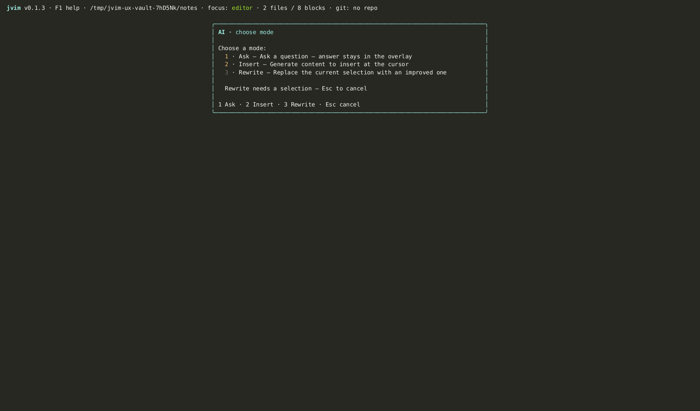
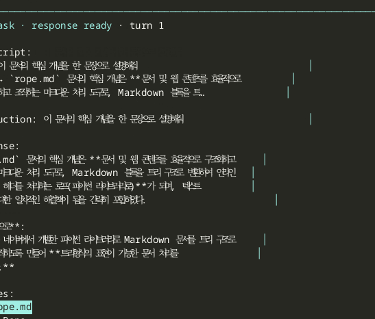

import AsciinemaPlayer from '../../../../components/AsciinemaPlayer.astro';
import KeymapTable from '../../../../components/KeymapTable.astro';

jvim은 편집 워크플로우 전반에 AI 지원을 통합합니다. AI 오버레이(`F6`)는 서로 다른 작업을 위한 세 가지 모드를 제공하고, 인라인 고스트 텍스트 자동완성은 입력하는 동안 작동하며, AI 컨텍스트 메뉴는 전체 프롬프트를 열지 않고도 빠른 작업을 수행합니다. 모든 AI 기능은 옵트인 방식입니다 — 명시적으로 호출하지 않는 한 네트워크 트래픽이 전송되지 않습니다.

<AsciinemaPlayer slug="ai-overlay" title="AI 오버레이: Ask, Insert, Rewrite, 인라인 자동완성" />

## AI 오버레이 — 세 가지 모드

`F6`을 눌러 AI 프롬프트 오버레이를 열고 모드를 선택하세요:



<KeymapTable rows={[
  { keys: 'F6', action: 'AI 오버레이 열기', notes: '모드 선택기 표시: Ask / Insert / Rewrite' },
  { keys: 'Esc', action: '오버레이 닫기', notes: '프롬프트를 전송하지 않고 닫습니다' },
  { keys: 'Ctrl+Z', action: 'AI 결과 되돌리기', notes: '수락 후 Insert 또는 Rewrite를 취소합니다' },
]} />

### Ask

**Ask**는 볼트 인식 Q&A 인터페이스입니다. 질문을 입력하면 jvim이 문맥에 맞게 답변합니다. 시맨틱 인덱스가 사용 가능한 경우, 첫 번째 응답은 모델의 일반 지식이 아닌 내 노트를 기반으로 답변을 생성하기 위해 볼트에서 관련 청크를 먼저 검색합니다.

응답 이후에는 **Sources** 섹션에 기여한 볼트 노트들이 스니펫 미리보기와 함께 나열됩니다. 화살표 키로 출처를 탐색하고 `O`를 눌러 해당 노트를 바로 열 수 있습니다.



<KeymapTable rows={[
  { keys: 'F6 → Ask', action: 'Ask 모드 열기', notes: '볼트 인식 Q&A; 시맨틱 인덱스가 있으면 활용합니다' },
  { keys: 'Enter', action: '질문 / 후속 질문 제출', notes: '프롬프트 전송; 이후 Enter는 후속 질문을 보냅니다' },
  { keys: 'O', action: '출처 노트 열기', notes: '강조 표시된 RAG 출처를 에디터에서 엽니다' },
]} />

### Insert

**Insert**는 커서 위치에 새 내용을 생성합니다. 텍스트를 선택하면 해당 선택 영역이 모델의 문맥으로 전달됩니다. 선택 영역이 없으면 jvim이 자동으로 주변 섹션을 문맥으로 사용합니다.

생성된 텍스트는 실시간으로 버퍼에 스트리밍됩니다. 되돌리기(`Ctrl+Z`)는 삽입 전체를 한 단계로 제거합니다.

### Rewrite

**Rewrite**는 선택 영역을 AI가 수정한 내용으로 교체합니다. 개선하고 싶은 텍스트를 선택하고, `F6`으로 오버레이를 열어 Rewrite를 선택한 후, 원하는 변경 사항을 설명하세요. 모델이 선택 영역을 그 자리에서 교체합니다.

결과가 마음에 들지 않으면 `Ctrl+Z`로 원래 선택 영역을 한 단계로 복원합니다.

## AI 컨텍스트 메뉴

컨텍스트 메뉴(`Alt+/`)는 커서 옆에 인라인 작업 선택기를 열어줍니다 — 전체 오버레이가 필요 없습니다. 일반적인 재작성 및 삽입 작업이 나열됩니다: 글쓰기 계속, 단락 완성, 교정, 요약, 번역, 어조 변경.

<KeymapTable rows={[
  { keys: 'Alt+/ 또는 Ctrl+/', action: 'AI 컨텍스트 메뉴 열기', notes: '커서 위치의 인라인 작업 선택기' },
  { keys: '↑ / ↓', action: '작업 선택', notes: '작업 목록 탐색' },
  { keys: 'Enter', action: '작업 실행', notes: '선택 영역 또는 문맥에 선택한 작업을 적용합니다' },
  { keys: 'Esc', action: '닫기', notes: '작업 실행 없이 닫습니다' },
]} />

텍스트가 선택된 경우, 재작성 유형 작업(교정, 요약, 번역)은 선택 영역을 대상으로 합니다. 선택 영역이 없으면 삽입 유형 작업(글쓰기 계속, 단락 완성)은 주변 문맥을 사용합니다.

## 인라인 자동완성

인라인 자동완성은 입력하는 동안 Copilot 스타일의 고스트 텍스트를 표시합니다. 기본적으로 꺼져 있으며 `Alt+I` 또는 `F9`로 켤 수 있습니다.

활성화되면 입력을 잠시 멈출 때 jvim이 자동완성을 요청합니다. 제안은 커서에서 이어지는 희미한 고스트 텍스트로 나타납니다. 전체를 수락하거나, 한 단어씩 수락하거나, 계속 입력해서 무시할 수 있습니다.

<KeymapTable rows={[
  { keys: 'Alt+I / F9', action: '인라인 자동완성 전환', notes: '고스트 텍스트 제안을 켜거나 끕니다' },
  { keys: 'Tab', action: '전체 제안 수락', notes: '고스트 텍스트 자동완성 전체를 삽입합니다' },
  { keys: '→ / Ctrl+→', action: '한 단어 수락', notes: '제안의 다음 단어만 삽입합니다' },
  { keys: '다른 키', action: '제안 무시', notes: '고스트 텍스트가 사라지고 일반 입력이 계속됩니다' },
]} />

상태 바에는 인라인 자동완성의 활성 여부와 연결 오류(API 키 누락, 엔드포인트 접근 불가)를 나타내는 AI 배지가 표시됩니다.

Ask/Rewrite보다 빠르고 저렴한 모델을 인라인 자동완성에 사용하려면 `providers.toml`에서 `inline_model`을 별도로 설정하세요.

## 프로바이더 설정

jvim은 OpenAI 호환 엔드포인트, Anthropic, 로컬 LLM(Ollama, llama.cpp, 또는 OpenAI 호환 채팅 API를 제공하는 서버)과 함께 동작합니다.

`~/.config/jvim/config.toml`에서 프로바이더를 설정하세요 (또는 `F10`의 설정 오버레이를 통해):

```toml
[ai]
provider = "openai"       # openai | anthropic | ollama | custom
model = "gpt-4o"
inline_model = "gpt-4o-mini"   # 선택 사항: 고스트 텍스트용 경량 모델
```

로컬 LLM의 경우 `provider = "ollama"`로 설정하고 필요에 따라 기본 URL을 재정의하세요:

```toml
[ai]
provider = "ollama"
base_url = "http://localhost:11434"
model = "llama3"
```

AI 작업을 명시적으로 호출하기 전까지는 어떤 프로바이더에도 트래픽이 전송되지 않습니다. 인라인 자동완성 전환은 기본적으로 꺼져 있습니다.

## 관련 항목

- [시맨틱 인덱스](/jvim-public/ko/usage/semantic-index/)
- [설정](/jvim-public/ko/usage/settings/)
- [키맵 — 전체 참조](/jvim-public/ko/keymap/full/)
