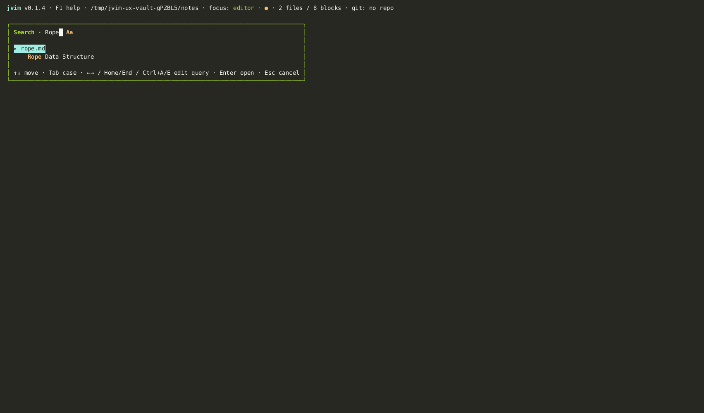

import AsciinemaPlayer from '../../../../components/AsciinemaPlayer.astro';
import KeymapTable from '../../../../components/KeymapTable.astro';

jvim의 문서 내 검색은 입력하는 동안 실시간으로 일치 항목을 하이라이트하고 하나씩 이동할 수 있습니다. 별도의 전체 치환 대화상자로 키보드를 벗어나지 않고 일괄 치환을 처리합니다.

<AsciinemaPlayer slug="find-replace" title="검색 / 치환: 검색, 대소문자 전환, 전체 치환" />

## 문서 내 검색

`Ctrl+F`를 눌러 검색 오버레이를 엽니다. 입력을 시작하면 현재 버퍼의 모든 일치 항목이 즉시 하이라이트됩니다. 오버레이의 일치 카운터에서 발견된 항목 수를 확인할 수 있습니다.

<KeymapTable rows={[
  { keys: 'Ctrl+F', action: '검색 오버레이 열기', notes: '현재 버퍼에서 실시간 검색을 시작합니다' },
  { keys: 'Enter', action: '다음 일치 항목', notes: '다음 항목으로 앞으로 이동' },
  { keys: 'Shift+Enter', action: '이전 일치 항목', notes: '이전 항목으로 뒤로 이동' },
  { keys: 'Esc', action: '검색 닫기', notes: '오버레이 닫기; 하이라이트 해제' },
]} />

## 대소문자 구분 전환

기본적으로 검색은 대소문자를 구분하지 않습니다. 검색 오버레이 내에서 `Tab`을 눌러 대소문자 구분을 전환합니다. 대소문자 구분 모드가 활성화되면 상태바에 `Aa` 배지가 표시됩니다.

<KeymapTable rows={[
  { keys: 'Tab', action: '대소문자 구분 전환', notes: '상태바의 Aa 배지가 대소문자 구분 모드 활성화를 나타냄' },
]} />

전환하면 현재 쿼리로 검색이 즉시 다시 실행되어 일치 카운트와 하이라이트가 동시에 업데이트됩니다.

## 전체 치환

`Ctrl+T`로 전체 치환 대화상자를 엽니다. 검색어와 치환 문자열 두 가지를 입력하면 버퍼의 모든 항목을 한 번에 치환합니다.

<KeymapTable rows={[
  { keys: 'Ctrl+T', action: '전체 치환 대화상자 열기', notes: '검색 문자열 입력, 치환 문자열 입력, 확인 순서로 진행' },
]} />

치환은 메모리 내 버퍼에 적용됩니다. `Ctrl+S`로 저장하기 전에 결과를 검토하세요. 의도한 결과가 아니라면 `Ctrl+Z`로 전체 치환을 한 단계에 실행 취소할 수 있습니다.

## 관련 문서

- [Vault 검색](/jvim-public/ko/usage/vault-search/)
- [포맷](/jvim-public/ko/usage/formatting/)
- [키맵 — 전체 참고](/jvim-public/ko/keymap/full/)
