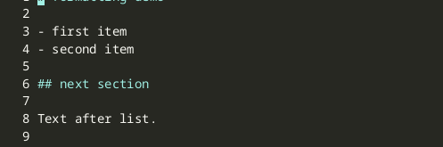

import AsciinemaPlayer from '../../../../components/AsciinemaPlayer.astro';
import KeymapTable from '../../../../components/KeymapTable.astro';

jvim의 내장 포매터는 포커스를 이동하지 않고 버퍼를 정리합니다. 단 하나의 키 입력으로 전체 문서를 포맷하거나, 선택한 영역으로 변경 범위를 제한할 수 있습니다. Markdown 목록은 일관된 간격과 번호 매기기로 정리되며, 코드 및 설정 파일은 지원되는 언어에서 Prettier 스타일로 정규화됩니다.

<AsciinemaPlayer slug="formatting" title="포맷: 문서 및 선택 영역 포맷" />

## 현재 문서 포맷

`Alt+F`를 눌러 현재 버퍼 전체에 포매터를 실행합니다. 결과는 그 자리에서 나타납니다 — jvim은 diff나 보조 패널을 열지 않습니다. 포맷 후 바로 계속 입력할 수 있으며, 커서는 에디터에 그대로 유지됩니다.

Markdown 파일의 경우 포매터는:
- 순서 없는 목록의 들여쓰기와 불릿 일관성을 수정합니다.
- 순서가 어긋난 순서 있는 목록의 번호를 재정렬합니다.
- 헤딩과 펜스드 코드 블록 주변의 빈 줄을 정규화합니다.

코드 및 설정 파일(JSON, YAML, TOML, TypeScript, …)의 경우 언어가 지원되면 Prettier 호환 스타일을 적용합니다.

<KeymapTable rows={[
  { keys: 'Alt+F', action: '현재 문서 포맷', notes: '전체 버퍼에 적용; 커서는 그 자리에 유지됨' },
  { keys: 'Ctrl+S', action: '저장', notes: '디스크에 쓰기 전에 버퍼에서 포맷된 결과를 검토하세요' },
]} />

## 선택 영역 포맷

문서의 일부만 재포맷하려면 `Shift+Arrow` 또는 `Shift+Click`으로 먼저 영역을 선택한 후 `Alt+Shift+F`를 누릅니다. 선택된 줄만 변경되며, 나머지 버퍼는 그대로 유지됩니다.

<KeymapTable rows={[
  { keys: 'Alt+Shift+F', action: '선택 영역 포맷', notes: '활성 선택이 필요; 선택이 없으면 아무 작업도 하지 않음' },
]} />

선택 영역만 포맷하는 기능은 수동으로 작성한 본문과 그대로 유지해야 하는 자동 생성 테이블 또는 코드 블록이 혼합된 파일에 유용합니다.

## 저장 전 검토

포맷은 즉시 메모리 내 버퍼에 적용되지만 파일이 자동으로 저장되지는 않습니다. 만족스러우면 `Ctrl+S`로 디스크에 쓰세요. 예상한 결과가 아니라면 `Ctrl+Z`로 포맷 작업을 한 단계에 실행 취소할 수 있습니다.

<KeymapTable rows={[
  { keys: 'Ctrl+Z', action: '실행 취소', notes: '전체 포맷 작업을 한 번에 되돌립니다' },
]} />

## 관련 문서

- [에디터 기본](/jvim-public/ko/usage/editor-basics/)
- [검색 / 치환](/jvim-public/ko/usage/find-replace/)
- [키맵 — 전체 참고](/jvim-public/ko/keymap/full/)
