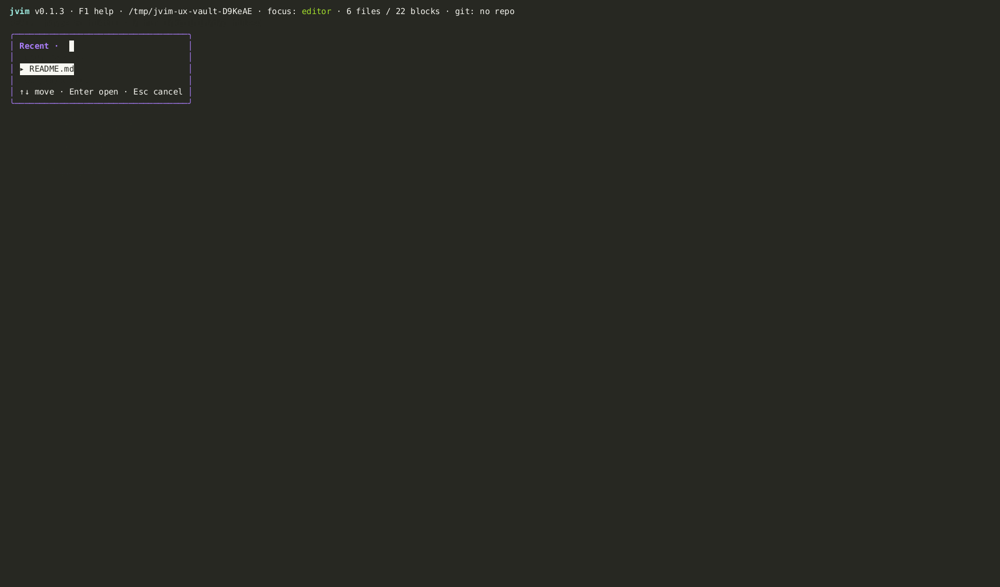

import AsciinemaPlayer from '../../../../components/AsciinemaPlayer.astro';
import KeymapTable from '../../../../components/KeymapTable.astro';

jvim은 빠른 내비게이션을 위한 여러 오버레이를 제공합니다: 공통 작업을 실행하는 커맨드 팔레트, vault 전체 파일 전환을 위한 파일 팔레트, 헤딩 간 이동을 위한 아웃라인 패널, 그리고 열린 문서를 순환하는 버퍼 탭이 있습니다.

<AsciinemaPlayer slug="navigation" title="내비게이션: 팔레트, 아웃라인, 줄 이동" />

## 커맨드 팔레트

커맨드 팔레트를 사용하면 이름의 일부를 입력해서 공통 jvim 작업을 실행할 수 있습니다. UI의 다른 곳에서도 사용할 수 있는 자주 쓰는 작업을 찾는 데 유용합니다.

<KeymapTable rows={[
  { keys: 'F4', action: '커맨드 팔레트 열기', notes: '공통 작업을 퍼지 검색' },
  { keys: 'Ctrl+P', action: '커맨드 팔레트 열기', notes: 'F4와 동일' },
  { keys: 'Enter', action: '선택한 명령 실행', notes: '하이라이트된 항목을 실행합니다' },
  { keys: 'Esc', action: '닫기', notes: '실행 없이 닫기' },
]} />

팔레트로 접근 가능한 작업 예시: `save`, `close document`, `find`, `replace`, `outline`, `vault search`, `backlinks`, 일부 git 작업.

## 파일 팔레트

파일 팔레트는 vault의 모든 파일에 대한 퍼지 검색 오버레이를 엽니다. 파일 이름을 대략 알고 있을 때 파일 트리보다 빠릅니다.

<KeymapTable rows={[
  { keys: 'Ctrl+O', action: '파일 팔레트 열기', notes: 'vault 전체 퍼지 파일명 검색' },
  { keys: 'Enter', action: '선택한 파일 열기', notes: '에디터에서 파일을 엽니다' },
  { keys: 'Esc', action: '닫기', notes: '열지 않고 에디터로 돌아가기' },
]} />

## 아웃라인 오버레이

아웃라인 오버레이는 현재 문서의 모든 Markdown 헤딩을 깊이에 따라 들여쓰기하여 나열합니다. 긴 문서에서 섹션 간 이동하는 가장 빠른 방법입니다.

<KeymapTable rows={[
  { keys: 'F2', action: '아웃라인 열기', notes: '현재 버퍼의 헤딩을 표시합니다' },
  { keys: '↑ / ↓', action: '헤딩 선택', notes: '헤딩 목록 이동' },
  { keys: 'Enter', action: '헤딩으로 이동', notes: '커서를 이동하고 오버레이를 닫습니다' },
  { keys: 'Esc', action: '닫기', notes: '이동 없이 닫기' },
]} />

## 줄 이동

정확한 줄 번호를 알고 있다면 아웃라인을 건너뛰고 바로 이동합니다.

<KeymapTable rows={[
  { keys: 'Shift+F3', action: '줄 이동', notes: '대화상자 열기 — 줄 번호를 입력하고 Enter를 누릅니다' },
]} />

## 버퍼 탭

열린 파일은 모두 버퍼에 유지됩니다. 에디터를 벗어나지 않고 모든 열린 버퍼를 순환할 수 있습니다.

<KeymapTable rows={[
  { keys: 'Ctrl+PgUp', action: '이전 버퍼', notes: '이전 열린 탭으로 전환' },
  { keys: 'Ctrl+PgDn', action: '다음 버퍼', notes: '다음 열린 탭으로 전환' },
]} />

## 관련 문서

- [에디터 기본](/jvim-public/ko/usage/editor-basics/)
- [Vault 검색](/jvim-public/ko/usage/vault-search/)
- [버퍼와 탭](/jvim-public/ko/usage/buffers-tabs/)
- [키맵 — 전체 참고](/jvim-public/ko/keymap/full/)
